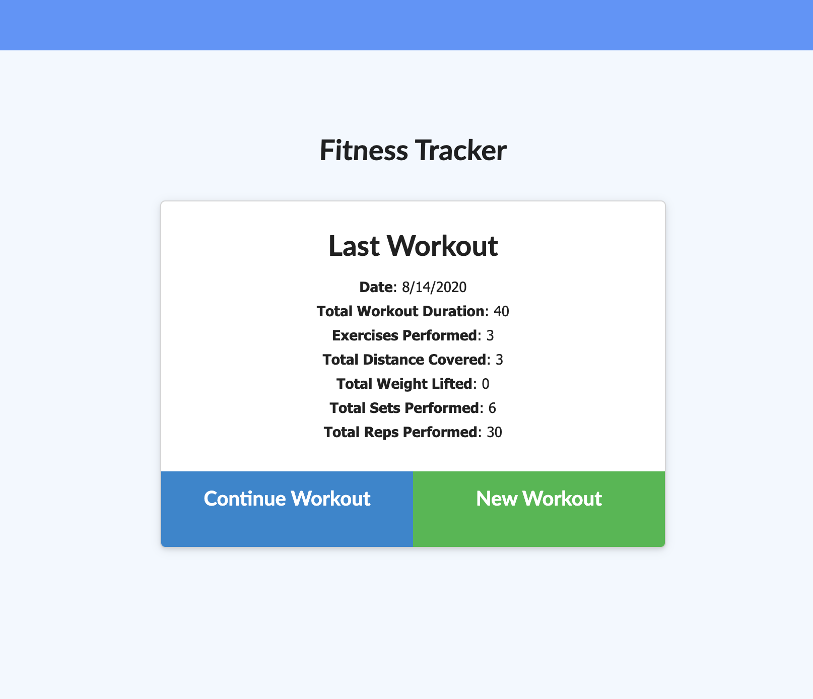

# Lift Now, Brunch Later

## Table of Contents
[Description](#description) 
[Author](#author)   
[Process](#process)  
[Contact](#contact)   
[Links](#links) 
[Demo]("#demo") 
## Description
It is easier to achieve goals when one is able to track their progress! This app was created to allow users to create and view their daily workouts. The user is able to input various stats such as: the type, name, sets, weight, reps, and duration. If it is a cardio exercise, the user is able to input the distance travelled. 

The use is also able to view various statistics of their workouts on the "stats" page.
## Author
Kimberly Owens
## Process
This app was created using mongoose, express, node.js and deployed on Heroku using mLab. 
## Contact
[Github- kimberlyj227](https://github.com/kimberlyj227) 
Email : kimberlycodes27@gmail.com
## Links
[LIFT NOW, BRUNCH LATER](https://liftnow-brunchlater.herokuapp.com/)
## Demo

